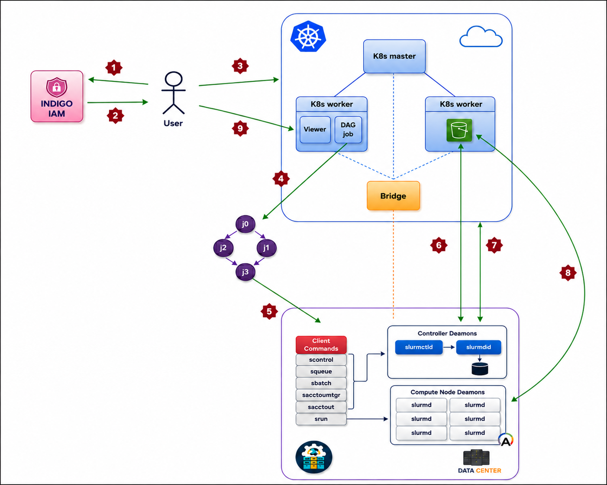

# 2KLUSTER

2KLUSTER is a Proof-of-Concept platform for integrating cloud-native services with High Performance Computing resources in the context of distributed scientific workflows.

The project was developed to support the submission, execution, storage and visualization of molecular dynamics workloads by combining Kubernetes-based services with an external Slurm-based HPC backend. The platform uses MinIO as S3-compatible object storage, OIDC-based authentication through INDIGO-IAM, a web application for job submission, and Mol* for browser-based molecular visualization.



## Overview

The main goal of 2KLUSTER is to provide a simplified user-facing interface for submitting molecular dynamics jobs while keeping the computational execution on an HPC system.

The general workflow is the following:

1. A user accesses the platform through the web interface.
2. Authentication is handled through an OIDC-based login flow.
3. Input files and workflow data are organized in MinIO object storage.
4. The web application submits the computational workload to an external Slurm backend through a bridge virtual machine.
5. The job is executed on the HPC infrastructure.
6. Output files are uploaded back to MinIO.
7. Results can be accessed and visualized through Mol*.

This repository contains the configuration files and deployment resources used to reproduce the main components of the proof-of-concept architecture.

## Components

### MinIO

The `minio` directory contains the Kubernetes and Helm configuration files required to deploy MinIO as the S3-compatible object storage layer of the platform.

MinIO is used to store input datasets, configuration files, simulation outputs and logs. The provided manifests include:

* namespace and service configuration;
* ingress configuration for API and console access;
* persistent volume and persistent volume claim configuration;
* Helm values for a standalone MinIO deployment;
* an example S3 access policy;
* an NGINX reverse proxy configuration for MinIO API access;
* a `ClusterIssuer` configuration for TLS certificate management.

### Mol*

The `molstar` directory contains the resources used to deploy a Mol* instance in Kubernetes.

Mol* is used as the browser-based molecular visualization component of the platform. It allows users to inspect molecular structures and simulation outputs directly from the web interface.

The directory includes:

* a multi-stage Dockerfile for building and serving the Mol* viewer through NGINX;
* Kubernetes manifests for deployment and service exposure;
* oauth2-proxy configuration for OIDC-based access control;
* an NGINX reverse proxy configuration for path-based routing.

### Web application

The `web-app` directory contains the Kubernetes deployment configuration for the 2KLUSTER web interface.

The web application represents the user-facing layer of the platform. It is responsible for collecting job information, interacting with the object storage layer, and coordinating the submission of molecular dynamics jobs to the HPC backend.

The configuration includes:

* namespace and deployment resources;
* environment variables for the HPC login node, bridge VM and MinIO endpoint;
* service and ingress configuration;
* oauth2-proxy configuration for authenticated access;
* NGINX reverse proxy configuration for exposing the application under the `/2kluster` path.

## TLS and cert-manager setup

The platform exposes its web-based services securely through HTTPS by combining an NGINX Ingress Controller with cert-manager.

In this configuration, the applications inside the cluster continue to serve normal HTTP traffic through internal Kubernetes Services. TLS termination is handled externally by the Ingress layer, keeping the application containers decoupled from certificate management.

cert-manager can be installed by applying its official manifest to the cluster:

```bash
kubectl apply -f https://github.com/cert-manager/cert-manager/releases/download/v1.20.0/cert-manager.yaml
```

Once installed, cert-manager continuously watches the cluster for certificate-related resources and manages the full certificate lifecycle, including issuance and automatic renewal.

The Ingress resources include TLS sections that reference Kubernetes Secrets containing the certificates. They also include annotations that link the Ingress to the configured `ClusterIssuer`.

A simplified example is:

```yaml
annotations:
  cert-manager.io/cluster-issuer: letsencrypt-prod

tls:
  - hosts:
      - <HOST>
    secretName: <TLS_SECRET_NAME>
```

The `ClusterIssuer` uses the ACME protocol and the HTTP-01 challenge to verify domain ownership. During this process, cert-manager temporarily creates the required resources so that Let’s Encrypt can reach the service through the Ingress and validate the domain.

After validation, the signed certificate is stored inside the referenced Kubernetes Secret. The NGINX Ingress Controller then uses this Secret to terminate TLS connections. 

This approach avoids manual certificate generation and provides automatic certificate renewal before expiration.

## Authentication and Authorization Infrastructure

The platform adopts an Authentication and Authorization Infrastructure based on INDIGO-IAM as OIDC identity provider.

Two different authorization patterns are used:

```text
MinIO       → native OIDC integration with group-based authorization
Mol*        → access protected through oauth2-proxy
2KLUSTER    → access protected through oauth2-proxy
```

The main difference is that MinIO directly supports OIDC and can map identity claims to internal policies, while Mol* and the 2KLUSTER web application are protected externally by oauth2-proxy.

## MinIO OIDC integration and group-based authorization

OIDC integration can be configured with the MinIO client using:

```bash
mc admin config set myminio identity_openid \
  config_url= <OPENID-CONFIGURATION-URL> \
  client_id= <CLIENT_ID> \
  claim_name="groups" \
  scopes="openid,profile,email"

mc admin service restart myminio
```

In this configuration, MinIO uses the `groups` claim contained in the JWT token to assign policies to authenticated users.

### Example MinIO user policy

The repository includes an example policy for normal users in:

```text
minio/manifests/minio-user-policy.json
```

The policy can be loaded in MinIO with:

```bash
mc admin policy create myminio minio minio/manifests/minio-user-policy.json
```

The resulting behavior is:

| Groups in token         | Result                                                 |
| ----------------------- | ------------------------------------------------------ |
| `minio`                 | normal user access                                     |
| `consoleAdmin`          | full administrator access                              |
| `minio`, `consoleAdmin` | administrator access, because permissions are additive |

The key concept is:

```text
Authentication → INDIGO-IAM
Authorization  → MinIO policies
```


## Requirements

The deployment assumes the availability of:

* a Kubernetes cluster;
* `kubectl`;
* Helm;
* NGINX Ingress Controller;
* cert-manager;
* a valid domain name;
* an OIDC identity provider, such as INDIGO-IAM;
* MinIO client, `mc`;
* a MinIO-compatible S3 endpoint;
* a bridge VM able to reach the HPC login node;
* an HPC backend managed by Slurm;
* Docker, only if the Mol* image needs to be rebuilt.

## Configuration

Most manifests contain placeholder values that must be replaced before deployment.

Common placeholders include:

```text
<HOST>
<TLS_CERTIFICATE>
<TLS_SECRET_NAME>
<CLUSTER-ISSUER>
<OIDC-ISSUER>
<CLIENT_ID>
<CLIENT_SECRET>
<COOKIE_SECRET>
<MINIO-ENDPOINT>
<MINIO_CLIENT_ID>
<BUCKET-NAME>
<BRIDGE-PRIVATE-IP>
<BRIDGE-USER>
<HPC_PORTAL_HOSTNAME>
<WORKER_NODE>
```

Before applying the manifests, replace these values according to the target infrastructure.

Sensitive values, such as client secrets, cookie secrets and access credentials, should not be committed in plain text in a public repository. In a real deployment, they should be managed through Kubernetes Secrets or an external secret management system.


## Security notes

This repository is intended as a proof-of-concept configuration and should not be used as-is in production without additional hardening.

Important security aspects include:

* rotate exposed or temporary secrets;
* avoid committing `client-secret`, `cookie-secret` or access credentials;
* ensure HTTPS is always enabled through Ingress TLS;
* ensure OIDC tokens include the required `groups` claim;
* restrict MinIO policies according to the principle of least privilege;
* prefer Kubernetes Secrets or an external secret manager for sensitive values;
* review group membership in INDIGO-IAM before assigning administrative permissions.

## Status

This repository represents an academic proof-of-concept and is not intended to be used as a production-ready deployment without further hardening.

Possible future improvements include:

* stronger secret management;
* private bucket policies and user-aware storage authorization;
* token exchange for delegated access to services;
* improved user-level job submission;
* support for more complex multi-node Slurm workloads;
* more complete automation of the deployment procedure.

## Web application source code

This repository mainly contains the Kubernetes manifests and deployment configuration files required to reproduce the 2KLUSTER proof-of-concept environment.

The source code and scripts of the 2KLUSTER web application are maintained in a separate repository:

[2KLUSTER Web Application Scripts](<WEB_APP_REPOSITORY_URL>)

That repository includes the Python scripts used to manage the workflow logic, including job submission, interaction with MinIO object storage, OIDC/STS authentication handling, SSH communication with the bridge VM and submission to the Slurm-based HPC backend.


## License

This project is licensed under the Apache License 2.0. See the `LICENSE` file for details.
